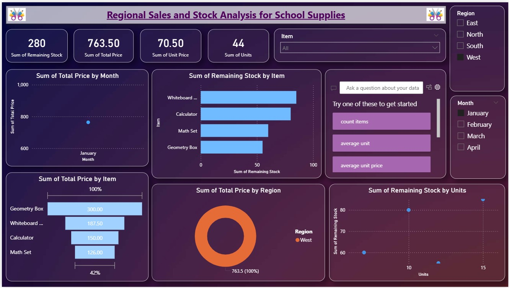

# 📊 Regional Sales and Stock Analysis Dashboard

This repository showcases a **Power BI Dashboard** for analyzing **Regional Sales and Stock of School Supplies**.

## 🔎 Overview
The dashboard provides insights into:
- Total sales and stock by **item**  
- Stock availability and unit prices  
- Regional breakdown of sales  
- Monthly sales trends  

## 📷 Dashboard Preview

👉 [Download the Power BI Dashboard (.pbix)](dashboard.pbix)

## 🛠 Tools Used
- **Power BI Desktop** – for data visualization and report building  
- **Excel/CSV** (sample data, not included) – as the data source  

## ✨ Features
- Total Stock & Sales Overview  
- Breakdown by Item, Region, and Month  
- Interactive filters for items and regions  
- Visualizations: bar charts, donut chart, scatter plot  

